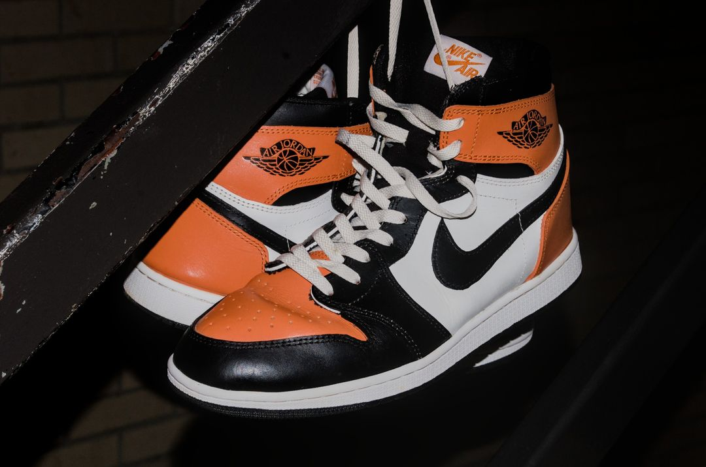
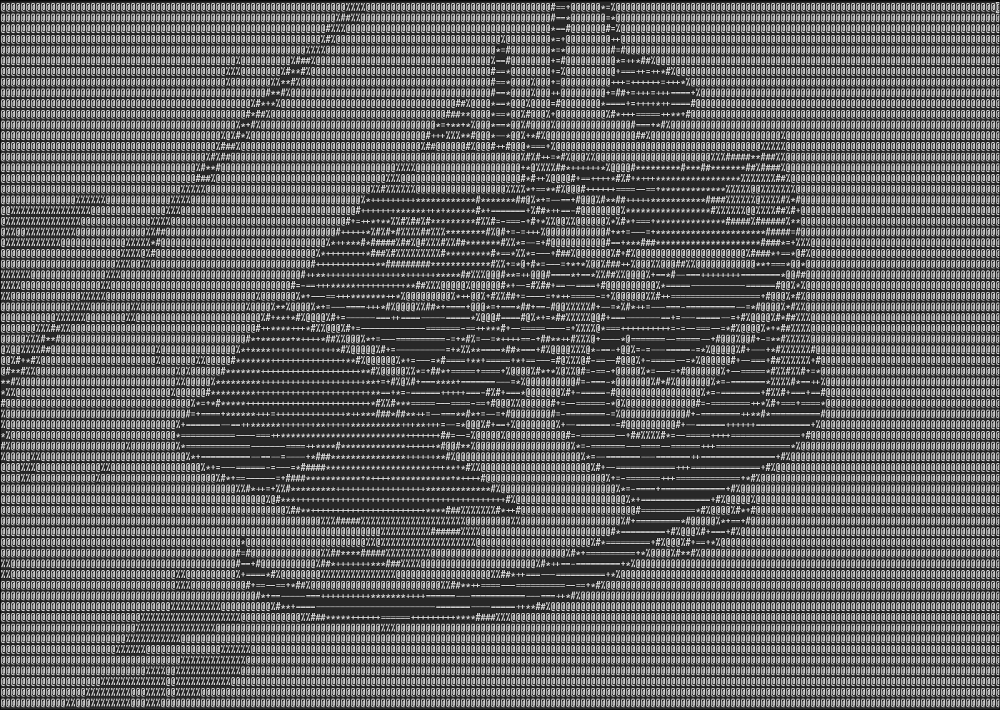

# Image to ASCII Converter

Command-line utility to convert image to ascii art.

### Before


### After


## Dependencies
- Python 3.x
- Pillow

## Usage

``` sh
asciize <image_path> --width <output_width> --contrast <contrast_level> --output <output_path>

```

### Optional arguments:
- `--width`: Output width of ASCII art (default is 200).
- `--contrast`: Contrast level for the image (default is 1.0).
